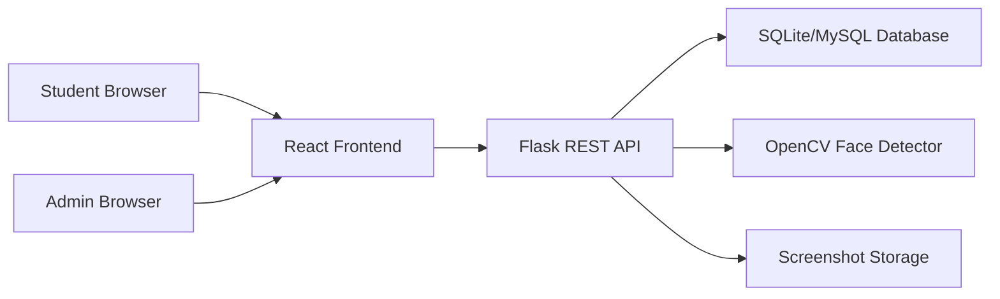

# System Architecture

## High-Level Design

## Modules

- `frontend/src/pages`: Login, signup, student dashboard, admin dashboard, exam screen.
- `frontend/src/components`: Reusable layout, cards, webcam monitor, warning popup.
- `frontend/src/services`: Axios API client with JWT injection.
- `backend/models`: SQLAlchemy models for users, exams, questions, results, warnings, and cheating logs.
- `backend/routes`: REST routes grouped by auth, exam, admin, and proctoring concerns.
- `backend/services`: JWT helpers and OpenCV face detection logic.

## Database Design

- `users`: Stores student/admin accounts and password hashes.
- `exams`: Stores exam metadata, duration, active flag, and warning limit.
- `questions`: Stores MCQ question text, options, correct option, and marks.
- `results`: Stores submitted answers, score, percentage, and auto-submit status.
- `warnings`: Stores warning events displayed to students.
- `cheating_logs`: Stores suspicious activity records and screenshot filenames.

## AI Detection Logic

1. Frontend captures a JPEG frame from the webcam every five seconds.
2. Frame is sent to `/api/proctor/analyze-frame`.
3. Flask decodes the base64 frame using NumPy and OpenCV.
4. Haar Cascade detects frontal faces.
5. Backend classifies the frame:
   - `NORMAL`: exactly one face
   - `NO_FACE`: zero faces
   - `MULTIPLE_FACES`: more than one face
6. Suspicious events generate a warning, cheating log, confidence score, and screenshot.

## Tab Switching Detection

The exam page listens for `document.visibilitychange`. When `document.hidden` becomes true, the app calls `/api/proctor/event` with `TAB_SWITCH`. Browser minimize usually triggers the same signal. The page also listens for `window.blur` as a second focus-loss signal.

## Fullscreen Enforcement

Before the exam starts, the student must call `document.documentElement.requestFullscreen()`. During the exam, the page listens to `fullscreenchange`; if `document.fullscreenElement` is empty, it records a `FULLSCREEN_EXIT` warning. When warning count reaches the exam maximum, the frontend auto-submits.

## Security Notes

Frontend restrictions increase exam integrity but cannot guarantee full lockdown by themselves. Production deployments should add HTTPS, rate limits, server-side attempt states, audit trails, identity verification, secure storage, and human review.
